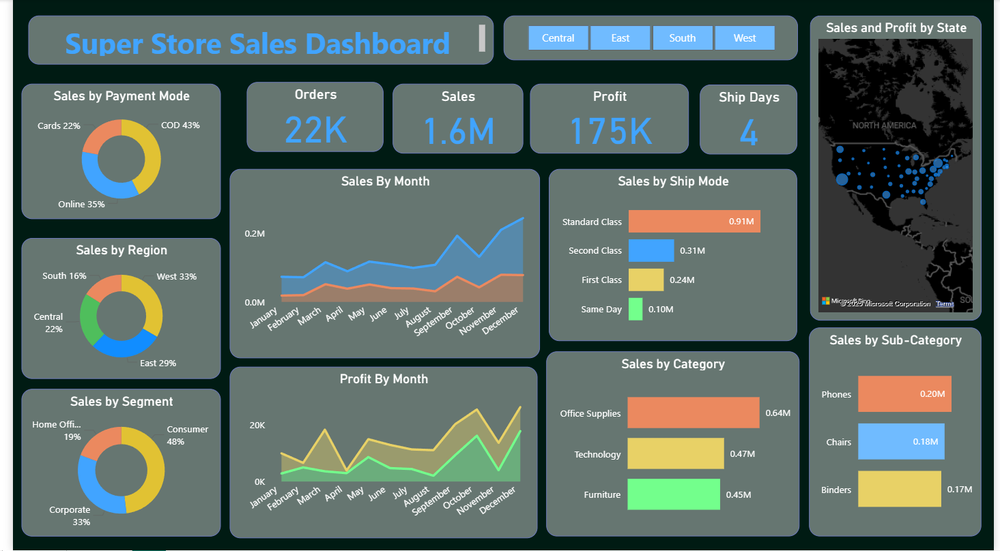
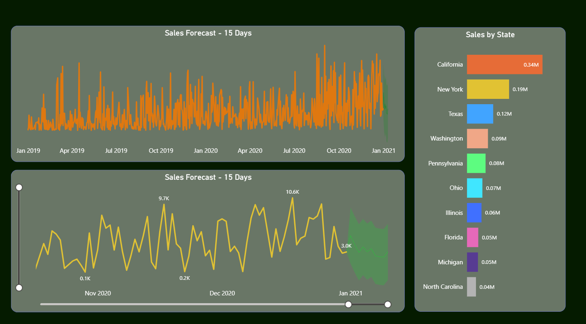

📊 Superstore Sales Forecasting Dashboard

📝 Project Title  
Superstore Sales Forecasting and Business Intelligence Dashboard 
An end-to-end analytics and BI solution using Power BI, focused on actionable sales insights and time series forecasting.

🧠 Short Description  
This project presents a comprehensive data analysis and visualization solution for a supermarket’s sales data. Using Power BI, the dashboard delivers real-time metrics, sales performance breakdowns, and a 15-day future sales forecast using time series modeling. It empowers stakeholders to monitor key KPIs, evaluate performance by category/region, and optimize business strategies.

⚙️ Tech Stack

- Power BI – Dashboard design, DAX measures, custom visuals  
- CSV (Excel) – Data input format  
- Time Series Forecasting – Power BI's built-in analytics + trend projection  
- Data Modeling – Relationships, calculated columns  
- Visualization Tools – Line charts, pie charts, bar graphs, map visuals, KPI cards

 📂 Data Source

- Historical sales dataset of a retail chain (realistic mock data)
- Data fields include:
  - Order ID, Product Category, Sub-Category
  - Sales, Profit, Quantity
  - Region, Segment, Payment Mode, Shipping Mode
  - Order Date, Ship Date

🚀 Features

1. Dynamic KPI Cards – Live tracking of orders, sales, profit, and average shipping duration  
2. Segmented Sales Analysis – Drill-down by region, segment, payment, and shipping method  
3. Interactive Filtering – Region selectors and slicers for multi-dimensional exploration  
4. Time Series Forecasting – Next 15-day prediction of future sales based on historical patterns  
5. Geographical Mapping – Sales and profit breakdown by US states  
6. Sales Performance by Category/Sub-Category – Visual segmentation of top-performing items  
7. Profitability Analysis – Trend view of monthly profits and sales

 🌟 Project Highlights with Visuals

🎯 KPI Overview & Segmented Sales Insights

- Central KPIs: 22K Orders, ₹1.6M in Sales, ₹175K Profit, Avg Ship Days: 4  
- Sales visualized by Region, Payment Mode, Segment, and Shipping Type  
- Map Visualization: Interactive heat map showing sales & profit by U.S. states  
- Time-based analytics: Monthly trends in both sales and profit

🔮 Time Series Forecasting (Next 15 Days)

- Applied Power BI’s Forecasting Tool  
- Forecast horizon: 15 days forward from last recorded entry  
- Displays confidence intervals, trend variations, and predicted spikes  
- Enables forward planning for inventory, promotions, and sales targets

 🧾 Business Value Delivered

| Area | Impact |
| 📈 Sales Planning | Future trend forecasting helps in proactive inventory management |
| 📊 Data-Driven Culture | Dashboard promotes centralized visibility of operations |
| 🧠 Strategic Decisions | Visuals help identify top-selling categories & regions |
| 🧩 Customization | Users can slice data by multiple filters (region, category, ship mode) |
